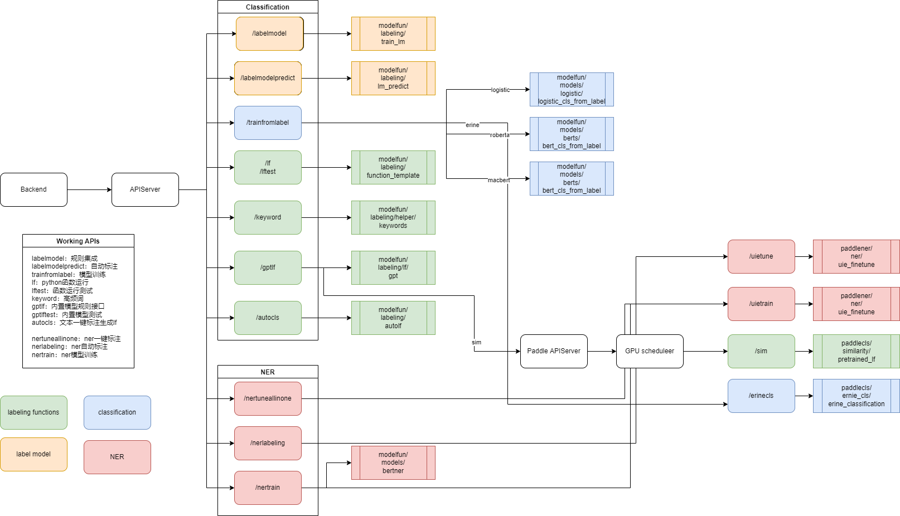

# ModelFun 算法库
## 功能概述
当前主要实现了标签函数运行、模型聚合、模型训练等功能，任务上支持分类和NER。
这里是非paddle部分，paddle相关见另一个项目
## 文件概述
- datasets/  测试用数据集
- documentation/ 与后端交互用到的数据集
- apis/  算法接口
  - infor.py  数据接口定义
  - classification.py 分类相关功能
  - cls_pretrain.py  与分类的预训练相关
  - ner.py  ner相关功能
  - ner_pretrain.py ner预训练相关
- modelfun/  主要文件。
  - analysis/ 分析相应指标
  - labeling/  实现了标记函数的运行和聚合操作
    - metrics.py 分类的metric
    - ner_metrics.py NER 的metric
  - models/ 实现了现有的分类模型和NER模型。
    包含了分类和NER的model，见相应文件即可
  - utils/  一些诸如数据读写的辅助代码
    
- test/  不同部分测试代码，待补充
- apiserver.py 与后端交互的服务器。

# 部署方法
## 安装环境
使用前需要安装环境，本项目的环境依赖可以直接用以下命令进行安装
```bash
pip install -i https://pypi.tuna.tsinghua.edu.cn/simple -r requirements.txt
```

# 代码逻辑

算法的调用逻辑见上图。主要涉及算法主要包括几个部分：
1. 常规的分类、NER算法，这部分主要是各个预训练模型以及相应的算法（算法模型等基本见名知义）
2. 多标签的聚合算法，这方面主要参考[snorkel的算法](https://arxiv.org/abs/1810.02840)
3. 自制的一些大模型，这部分主要是利用当前的大模型来进行
    > - content model: 基于示例样本的相似度对比
    > - label model: 基于一个预训练的零样本模型(joeddav/xlm-roberta-large-xnli)进行分类
    > - fast content model: 基于示例样本的聚类进行分类
4. 自动标注部分: 当前是基于关键词的提取和大模型的选择。

# 注意事项
- 注意保证环境的一致，当前conda和docker都能用，conda比较方便
- 如果是阿里云的服务器，安装seqeval可能出问题，先`pip install setuptools_scm`，[链接](https://github.com/chakki-works/seqeval/issues/78)


# 镜像编译
直接运行根据Dockerfile编译即可


# 参考资源
- 本项目中的弱监督聚合部分基于[snorkel](https://www.snorkel.org/)的方法
- 本项目预训练模型基于[transformers](https://huggingface.co/docs/transformers/index)开源实现
