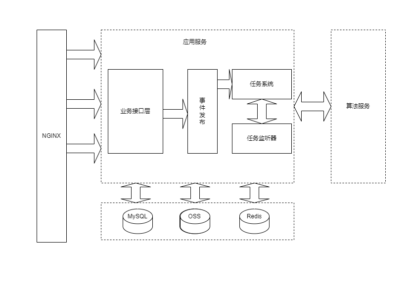
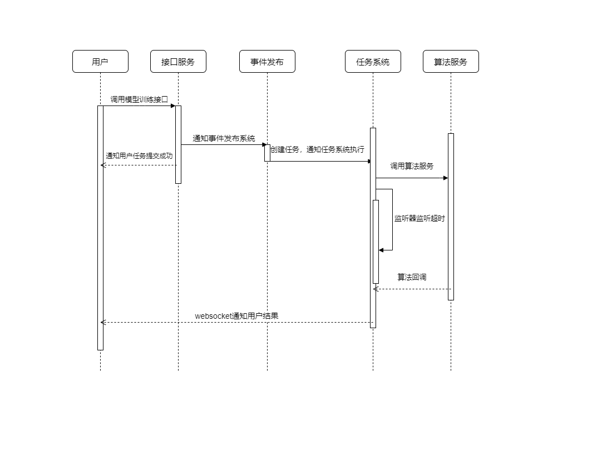

# modelfun后端项目说明

## 概览

该项目是基于springboot实现的单一部署的项目，使用MySQL作为数据库，Redis作为缓存。

服务内部使用事件通知的方式进行任务调配，对业务进行解耦。

该项目实现的功能为：

1. 数据集文件的上传和解析。
2. 实时查看数据集文件内容，管理数据集的变更。
3. 用户自定义规则对数据进行初步标注。
4. 根据用户规则进行集成，使用模型进行自动标注。
5. 根据自动标注的结果进行模型训练，最终获得一个可以部署调用的模型。

## 整体架构图

**说明：**

目前架构使用MySQL作为持久层，Minio作为文件存储服务，Redis作为缓存中间件，应用服务使用SpringBoot作为基础框架，SpringMvc作为http服务提供框架，内置tomcat作为Servlet服务器。其中：

- NGINX层：作为最外层网关，进行请求拦截、转发和负载均衡。
- 应用服务：应用服务就是当前整个项目，其内部包含了对外提供接口服务的业务层，内部通知任务事件的事件发布组件、执行对应任务的任务系统以及任务超时监听的监听器。
- 中间件：MySQL、Redis和OSS

接下来以模型训练接口调用的流程举例：

1. 用户调用模型训练接口
2. 接口服务收到请求，通知事件发布系统
3. 事件发布系统创建好需要执行的任务之后，把任务提交给任务系统。
4. 任务系统收到提交的任务，开始执行该任务，并且超时监听器开始监听任务状态。
5. 如果算法端在规定时间内返回结果，任务系统通过websocket通知用户任务成功，否则超时监听器通知用户任务失败。

## 编译构建环境依赖

- JDK11
- maven 3.6+
- 添加JAVA_HOME到PATH

### 代码目录以及运行说明

本项目基于maven进行代码管理，代码目录符合maven的约定：

. 
|——src 
|       |——main 
|       |        |——java 
|       |        |       |——com.wl.xc.modelfun				             // 项目包名 
|       |        |                          |——————commons           // 公共类包，存放枚举等公共类 
|       |        |                          |——————components      //  组件包，存放各种项目需要用到的组件 
|       |        |                          |——————config                // 配置类包，spring的相关配置都在该包下 
|       |        |                          |——————controller          // controller层 
|       |        |                          |——————entities             // 数据实例的包，包括VO，DTO，PO，BO等 
|       |        |                          |——————mapper            // mybatis对应的mapper接口包 
|       |        |                          |——————service             // service层 
|       |        |                          |——————tasks                // 任务相关的包，主要是对应文件解析任务，算法交互任务，规则运行任务 
|       |        |                          |——————utils                  // 各种工具类的包 
|       |        |                          |——————websocket       // websocket相关的包 
|       |        |                          |——————ModelFunApplication     // 项目启动类 
|       |        |  
|       |        |——resources 
|       |                |——mappers                      //  mybatis对应的xml文件 
|       |                |——application.yml            // 默认配置文件 
|       |                |——application-dev.yml      // 开发环境配置文件 
|       |                |——application-local.yml      // 本地环境配置文件 
|       |                |——application-pro.yml      // 正式环境配置文件 
|       |                |——application-test.yml      // 测试环境配置文件 

本项目基于maven进行依赖管理，配置完本地maven后即可导入项目进行开发。

- 构建

> mvn clean compile

- 打包

> mvn clean package

- 启动

打包完成后，会在target目录下生成一个modelfun-distribution.tar的压缩包，内部包含了项目的所有文件。
解压之后，在modelfun目录下运行如下命令构建docker镜像：

> docker build -t modelfun/backend:latest .

## 从源码直接构建docker镜像

> docker build -f Dockerfile_Src -t modelfun/backend:latest .

## 接口文档

本项目使用swagger进行接口文档管理，当启动项目后访问/swagger-ui/index.html进行查看

## 功能模块

- 框架基础

使用springboot进行开发，springmvc作为web相关组件，内置tomcat作为servlet服务器。

- 登录鉴权

使用spring-security作为权限拦截器，jwt用作权限校验方式，redis存储用户登录信息

- websocket

使用tomcat原生支持的@ServerEndpoint注解进行配置，通过用户登录信息与用户实时通信

- 任务模块

内部使用spring的ApplicationEventPublisher作为服务内部的事件通知，阻塞队列作为任务的存储。如果后期需要扩展为集群部署，可以把任务存储到redis中，

- 持久化层

使用MySQL作为数据库，mybatis-plus作为持久化层框架